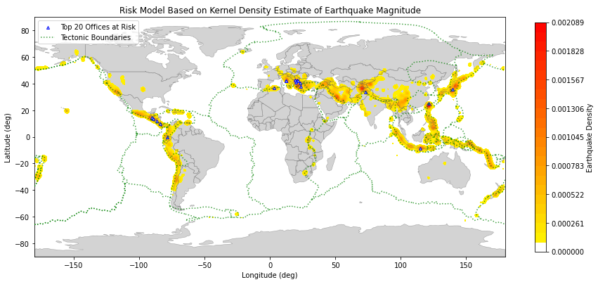
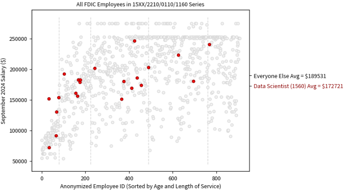

# Data-Science-Projects

A selection of data science projects I completed in my spare time.
* **Earthquake Risk Analysis** - Produced an assessment about earthquakes and the potential impact on U.S. Embassy and Consulate facilities for the U.S. Department of State. 

* **Government Salary Analysis** - Explored the [Enterprise Human Resources Integration-Statistical Data Mart](https://www.fedscope.opm.gov/datadefn/aehri_sdm.asp) (EHRI-SDM) data cube to compare data scientist salaries at the FDIC.

